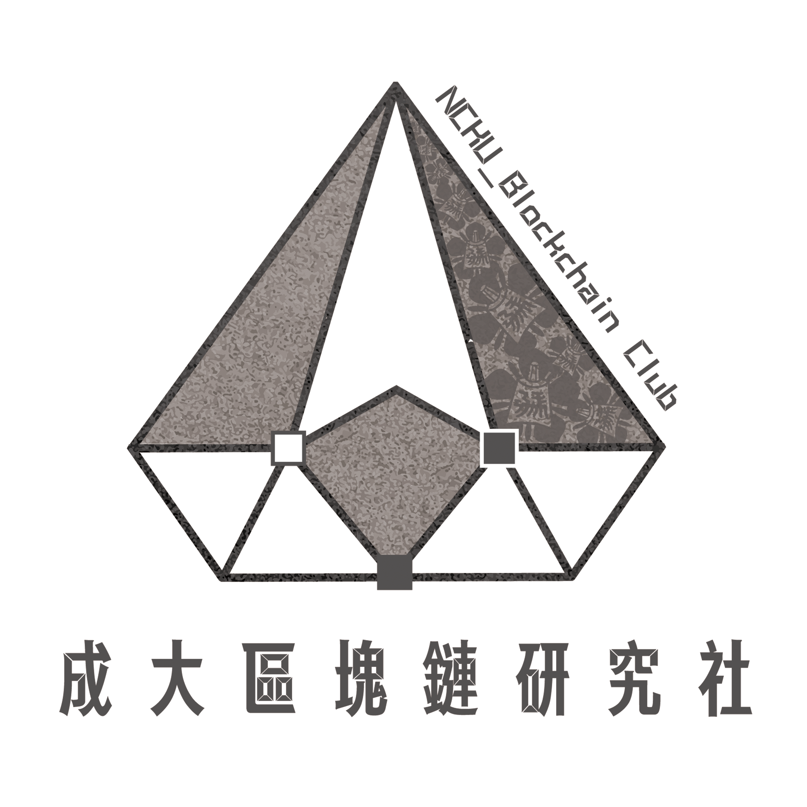
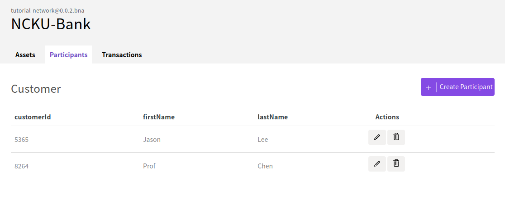
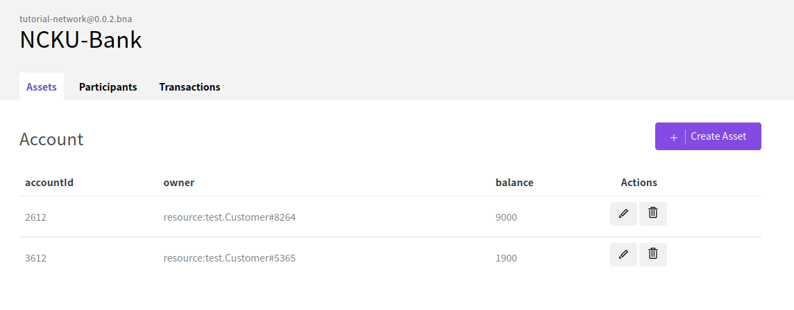
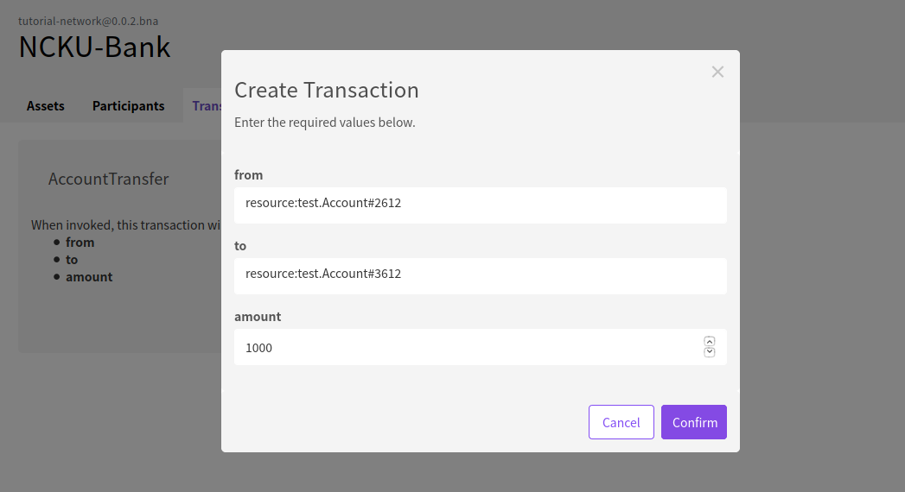
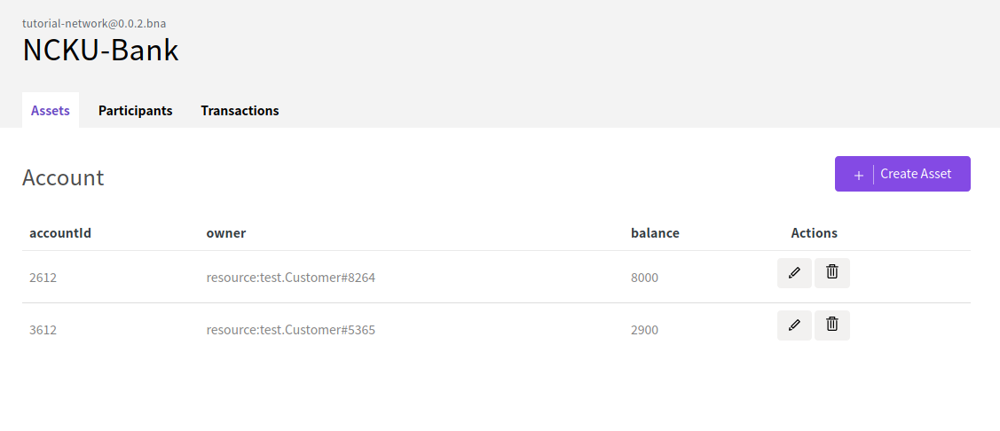
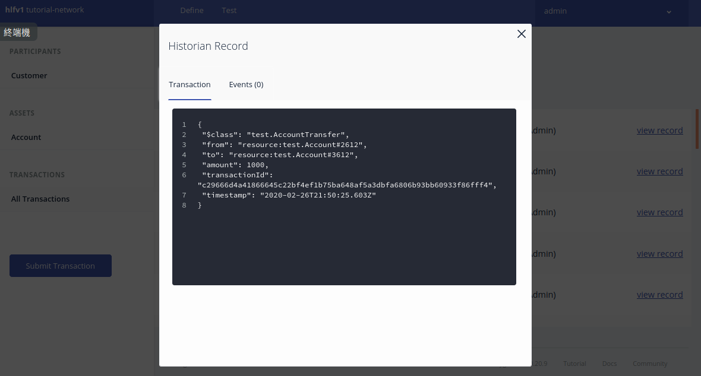

JAVA 程式設計 - 期末成品
======================

 

:star: 感謝老師打高分！  
這是一個在區塊鏈上建置簡單轉帳交易的應用程式，使用的區塊鏈架構是由 IBM 開發給 Linux 基金會的 [`Hyperledger Fabric`](https://www.hyperledger.org/projects/fabric)。如果對區塊鏈技術的開發有興趣或是想了解關於區塊鏈在證券、法規方面的同學，歡迎參加成大區塊鏈研究社！ 

⚠️  注意： ⚠️

`Hyperledger Composer` 已經被淘汰了，此教學只供基礎知識教學，後續開發建議使用 `Hyperledger Fabric 1.4 版以上` 

<h1 align="center">
   
  
    
  區塊鏈應用實作
   
</h1>

這是一個在區塊鏈上建置簡單轉帳交易的應用程式，使用的區塊鏈架構是由 IBM 開發給 Linux 基金會的 [`Hyperledger Fabric`](https://www.hyperledger.org/projects/fabric)。如果對區塊鏈技術的開發有興趣或是想了解關於區塊鏈在證券、法規方面的同學，歡迎參加我們成大區塊鏈研究社！ 

⚠️  注意： ⚠️

`Hyperledger Composer` 已經被淘汰了，此教學只供基礎知識教學，後續開發建議使用 `Hyperledger Fabric 1.4 版以上` 

## 成果圖
<table><tr>
<td></td>
</tr></table>

<table><tr>
<td></td>
</tr></table>

<table><tr>
<td></td>
</tr></table>

<table><tr>
<td></td>
</tr></table>

<table><tr>
<td></td>
</tr></table>
